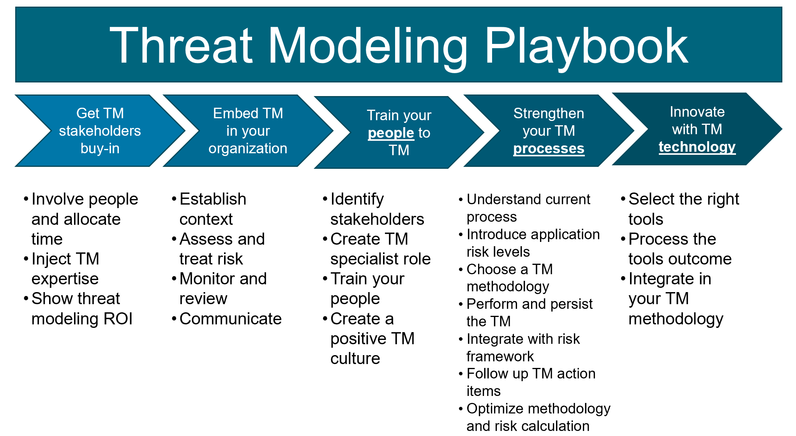

[![CC BY 4.0][cc-by-shield]][cc-by]

# はじめに
私たちは新しい脅威モデリングプレイブックで製品やソフトウェアのセキュリティを向上させることを目指しています。脅威モデリングはソフトウェア保証を向上させる基本的な活動であると考えています。優れた脅威モデリングの実践により、提供された製品のセキュリティ問題を大幅に減らすと確信しています。

オープンソースの強力な信奉者であり、OWASP の積極的な協力者でもある Toreon 社は、当社の顧客以外にも影響力を高めるため、この脅威モデリングプレイブックをコミュニティに寄贈します。

このプレイブックを使用して脅威モデリングの実践を改善してください。また、次のリリースでこのプレイブックをさらによくするために [OWASP threat modeling](https://owasp.org/www-community/Threat_Modeling) コミュニティにフィードバックを提供することをお勧めします。

この最初のリリースの作成を手伝ってくれた協力者 Jonas Muylaert, Joris Van den Broeck, Sebastien Deleersnyder, Steven Wierckx, Thomas Heyman (アルファベット順) に感謝します。また、この成果物を脅威モデリングコミュニティに寄贈することを決断した Toreon にも感謝します。

Sebastien Deleersnyder

CEO Toreon

OWASP ボランティア

2020 年 9 月 10 日

# PDF 版

ここでは脅威モデリングをマークダウンでリリースしています。
PDF 版をご希望の方は、当社の [ウェブサイト](https://www.toreon.com/threat-modeling-playbook/) からダウンロードできます。

# ダイアグラム

# 目次

### [1. 概論](playbook/1.%20Introduction.md)
### [2. 利害関係者からの承諾](playbook/2.%20Get%20stakeholder%20buy-in.md)
### [3. 組織への定着](playbook/3.%20Embed%20in%20your%20organization.md)
### [4. 脅威モデルのための人材育成](playbook/4.%20Train%20your%20people%20to%20threat%20model.md)
### [5. 脅威モデルプロセスの強化](playbook/5.%20Strengthen%20your%20threat%20model%20proces.md)
### [6. 脅威モデルテクノロジでの革新](playbook/6.%20Innovate%20with%20threat%20model%20technology.md)

# 著者
* ### Sebastien Deleersnyder
* ### Steven Wierckx
* ### Joris Van Den Broeck
* ### Thomas Heyman
* ### Jonas Muylaert

# ライセンス

本著作物は以下のもとでライセンスされます。
[Creative Commons Attribution 4.0 International License][cc-by]

[![CC BY 4.0][cc-by-image]][cc-by]

[cc-by]: http://creativecommons.org/licenses/by/4.0/
[cc-by-image]: https://i.creativecommons.org/l/by/4.0/88x31.png
[cc-by-shield]: https://img.shields.io/badge/License-CC%20BY%204.0-lightgrey.svg
