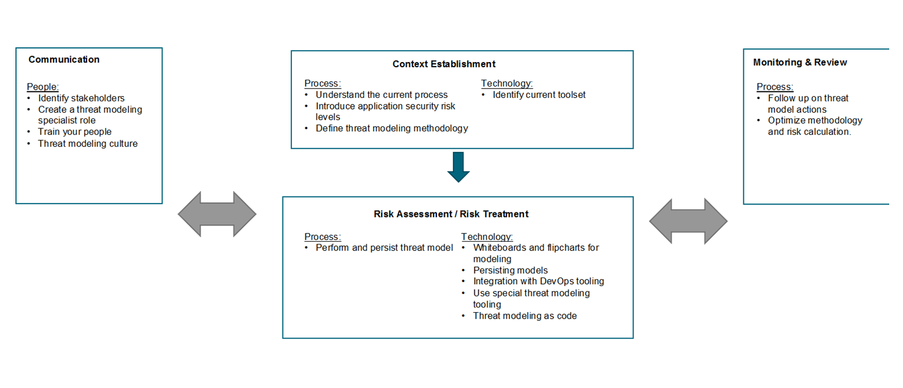

# 3. 組織への定着

脅威モデリングはリスクを特定するための手法であるため、組織のリスク管理プロセスに組み込む必要があります。ベストプラクティスとして私たちは ISO27005:2018 で説明されているリスク管理プロセスに着目し、脅威モデリング活動をこのプロセスにマップしています。

図 1 はリスク管理プロセスを構成する主要なステージの概要を簡略化して示したものです。脅威モデリング活動は三つのカテゴリに要約できます。

* 人: 誰がどのように関与するか
* プロセス: どのプロセスが存在する必要があるか、または適用させる必要があるか
* テクノロジ: どのようなツールやテクノロジが脅威モデリングを支援し促進できるか

脅威モデリングで検討するリスク管理ステージは以下のとおりです。

* コンテキストの確立
* コミュニケーション
* リスク評価と処置
* 監視とレビュー

これらの各ステージで、関連する脅威モデリング活動をマップします。これらの脅威モデリング活動は人、プロセス、テクノロジのカテゴリごとに分類されます。

## 3.1 コンテキストの確立

まず、自分の組織がどのようにリスクを扱い、管理しているかを理解する必要があります。同じリスクであっても組織が異なれば影響は全く異なります。脅威モデリングでは、コンテキストの確立に関して以下の活動が重要です。

#### **プロセス**:
* 5.1 現在のプロセスを理解する: 組織内の既存のプロセスと、そこに脅威モデリングをどのように統合するかを理解することが重要です。

* 5.2 アプリケーションセキュリティリスクレベルを導入する: アプリケーションセキュリティリスクレベルを使用し、脅威モデリングをいつ適用するかを決定することで、最初に最も重要なアプリケーションに集中できます。

* 5.3 脅威モデリング手法を定義する: 脅威モデルを定義する方法はたくさんあります。自分の組織に最も適した手法を選択する必要があります。

#### **テクノロジ**:
* 6.1 現在のツールセットを特定する: 組織内で使用されているツールやテクノロジを特定します。これにより既存のツールセットに脅威モデリングを統合する方法を評価することができます。

## 3.2 リスク評価と処置

次に、リスク評価ステージの一環として脅威モデリング活動を実行します。ここでは選択した脅威モデリング手法に従います。

#### **プロセス**:
* 5.4 脅威モデルを実行し永続化する: 脅威モデルを作成し保存します。

#### **テクノロジ**:
* 6.1 モデリング向けホワイトボードとフリップチャート: ほとんどの脅威モデリング手法ではホワイトボードやフリップチャートで簡単に始めることができます。

* 6.2 モデルの永続化: 脅威モデルを保存するためのツールとテクノロジ。

* 6.3 DevOps ツールとの統合: 開発環境で作業する場合は、開発ツールとの統合を強く推奨します。

* 6.3 特別な脅威モデリングツールの使用: 脅威モデルをサポートできる脅威モデリングツールが存在します。

* 6.3 コードとしての脅威モデリング (threat modeling as code): コードとしてのインフラストラクチャ (infrastructure as code) に従う – コードとしての脅威モデリング (threat modeling as code) も存在し、いくつかの利点があります。

特定されたリスクは組織で使用されているリスク管理の方針やプロセスに従って処理されるべきです。最初のステップはリスクの軽減、リスクの保持、リスクの回避、リスクの移転などさまざまなリスク処理のオプションを検討することです。費用便益計算に基づいて、最適なオプションを選択します。

## 3.3 監視とレビュー

第三に、リスクは静的ではなく時間の経過と主に変化します。リスクにつながる脆弱性の露出が変化したり、アプリケーション内の情報の機密性が変化したり、リスクの修正が間に合わないなどの可能性があります。そのためリスクとその要因を定期的に監視しレビューすることが重要です。脅威モデリングでは以下の活動で構成されます。

#### **プロセス**:
* 5.6 脅威モデルアクションをフォローアップする: 脅威モデルから得られた結果に対してアクションを実行する必要があります。

* 5.7 手法とリスク計算を最適化する: 継続的な改善を促進するには、脅威モデリング手法を監視し最適化する必要があります。

## 3.4 コミュニケーション
最後に、脅威モデルを作成する際にはコミュニケーションが重要です。コラボレーションなくして適切な脅威モデルを作成することはできません。

## **人**:
* 4.1 利害関係者を特定する: 脅威モデルの作成に関与するさまざまな利害関係者。

* 4.2 脅威モデリングスペシャリストのロールを作成する: 脅威モデルスペシャリストのロールは組織内での脅威モデリングを促進します。

* 4.3 従業員をトレーニングする: セキュリティ意識は非常に重要です。脅威モデリングを開始する際には、脅威モデリングのトレーニングが不可欠です。

* 4.4 脅威モデリングの文化: 脅威モデリングを支える文化を作ることが重要です。

[<< 前のページ](2.%20Get%20stakeholder%20buy-in.md) | [メインページ](../README.md) | [次のページ >>](4.%20Train%20your%20people%20to%20threat%20model.md)
| --- | --- | --- |
