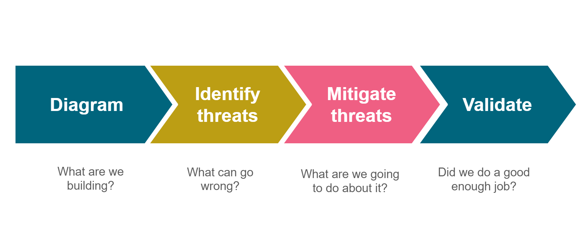

# 5 脅威モデルプロセスの強化

脅威モデルの成熟度を高めるには、適切なプロセスを設定することが不可欠です。プレイブックのこの章では、これらのプロセスの設定や更新について説明します。脅威モデリングのプロセスを決定する際には、5.1 章で説明するようにまず現在実施されているプロセスを把握する必要があります。アプリケーションのリスクレベルを決定して、どのような脅威モデル活動をなぜ実行する必要があるかを確認します。5.2 章はこれを行う方法について説明します。5.3 章は脅威モデルを開発する際に使用しなければならない正しい手法を選択するのに役立ちます。5.4 章では脅威モデルをその成果物によって永続化する方法について説明します。5.5 章では脅威モデルとリスク管理フレームワークの統合について説明します。5.6 章では脅威モデルで作成した緩和策をフォローアップする方法について考え方を提供します。最後の 5.7 章では、既に存在するさまざまなプロセスと、脅威モデルプロセスがこれらのプロセスとどのように相互作用するかを詳しく説明します。

## 5.1 現在のプロセスを把握する

OWASP SAMM [6] では SAMM 脅威評価の実践において脅威モデリングについて説明しています。基本的な脅威モデリングにはブレインストーミングと既存のダイアグラムに簡単な脅威チェックリストを加えたものを使用し、ベストエフォートでリスクペースの脅威モデリングとすべきです。

組織のどこに脅威モデリングを導入するかを決定するには、現在の脅威モデリングプロセスを理解し文書化することが有効です。 (どうせ脅威モデリングを行うなら) チームが何をしているかについて基本的な理解があることを確認してください。脅威モデリングはいつ実施しますか？どのようなインプットとアウトプットがありますか？どのような手順を踏みますか？

現在の脅威モデリング手順の基本的な概要を図にすることをお勧めします。この図をマップとしてこのプレイブックといっしょに使用して、このプレイブックで説明されている活動に基づいて、既存の脅威モデリングを改善できる箇所を確認します。

## 5.2 アプリケーションのリスクレベルを導入する

脅威モデリングは時間がかかる可能性のある作業であるため、どのアプリケーションに対してこれを行うかを決定する必要があります。一般的に、組織内のすべてのアプリケーションのリスクレベルが同じとは限りません。アプリケーションを異なるリスク「バケット」またはリスクプロファイルに分類することをお勧めします。通常、高リスク、中リスク、低リスクの三つのリスクプロファイルを使用します。アプリケーションのリスクレベルがあれば、OWASP SAMM や OWASP ASVS [7] などの、これらのレベルに依存する他の OWASP リソースを利用できます。

しかしその前にアプリケーションのリスクプロファイルレベルと組織に適した分類方法を定義する必要があります。システムのリスクレベルはそれらを保護するために実行する必要がある脅威モデル活動のレベルを決定します。リスク関連プロセスの詳細については第 3 章を参照してください。

簡単な方法を使用してアプリケーションごとのアプリケーションリスクを評価し、攻撃があった場合に組織にもたらす潜在的なビジネスインパクトを見積ります。これは OWASP SAMM のアプリケーションリスクプロファイル活動でも説明されています。例として三つのレベルに単純にリスクを分類する以下のスキームがあります。

* レベル 1 (低リスク) は重要なデータを持たず、完全な損失やデータの盗難などが組織に影響を与えないシステムに対するものです。例: 駐車場予約アプリケーション、ランチ注文アプリケーション … これらのアプリケーションには本格的な脅威モデルは必要ありません。
* レベル 2 (中リスク) はレベル 1 やレベル 3 に該当しないすべてのシステムが含まれます。実際には、重要ではないが GDPR の影響を受けるデータなどの機密データを持つシステムです。これらのシステムにはこのシステムのユースケースを扱う脅威モデルが必要です。
* レベル 3 (高リスク) システムとは非常に機密性の高いデータや大量の機密データを持つシステム、または侵害された場合に組織の存続を脅かすプロセスをコントロールするシステムを指します。例: 知的財産を処理するアプリケーション、物理的な世界での行動につながり人々に危害を及ぼす可能性があるシステム (セーフティの観点) 。これらのシステムには非常に詳細な脅威モデルが必要であり、非常に詳細なシステム要素に踏み込む可能性があります。システムスコープの一部であれば CPU 上のプロセス間通信にまで及びます。

データ侵害が組織に悪影響を与える場合、そのデータは機密情報とみなされます。

## 5.3 脅威モデリング手法を選択する

脅威モデル手法を選択する際のルールはただ一つです。もしそれがうまくいくなら、そのままにします。そうでなければ、変更します。これは非常に現実的なアプローチですが、さまざまな脅威モデル手法を比較評価することはできません。

脅威モデル手法は少なくとも以下のステップで質問に答えるべきです。

ステップは以下のとおりです。

#### **アプリケーションを図解する。**
アプリケーションの仕組みを詳細に理解することで、より関連性が高く、より詳細な脅威を発見することが容易になります。これにはセキュリティ目標の特定が含まれます。目標が明確であれば、脅威モデリング活動に集中でき、後続のステップにどのくらいの労力を費やすべきか判断しやすくなります。システムの重要な特性やアクターを項目として洗い出すことで、次のステップで関連する脅威を特定しやすくなります。

#### **脅威を特定する。**
前のステップの詳細を、システムのシナリオやコンテキストに関連する脅威を特定するためのテクニックとともに使用します。そのようなテクニックの例としてアタックツリー [8], STRIDE [9], LINDDUN [10] などがあります。

#### **脆弱性を緩和する。**
システムのレイヤをレビューして、脅威に関連する弱点を特定します。脆弱性カテゴリを使用することで、最も頻繁にミスが発生する領域に注力できます。

#### **妥当性確認する。**
脅威モデル全体を妥当性確認します。それぞれの脅威は緩和されているでしょうか？そうでない場合、残存リスクが明確に説明され、ビジネスリスクと結び付けられているでしょうか。セキュリティテストのスコープは一般的にこのステップで決定します。

脅威モデル手法の評価は 2 つのステップに大別できます。

1. 手法の健全性を評価する
2. 手法が適しているかどうかを評価する

学術研究 (Yskout, et al., 2020) では効果的な脅威モデル手法に存在すべき要素を記しています。

* モデルベース
* 追跡可能
* 体系的
* ビジネス統合
* コンテキスト指向
* スケーラブル

さまざまな脅威モデル手法の最近の概要はこの [Selin Juuso の修士論文](https://www.theseus.fi/bitstream/handle/10024/220967/Selin_Juuso.pdf) (2019) にあります。これらの要素を持っていない脅威モデル手法をすべて排除すれば、あなたの組織の潜在的な候補リストになります。手法に対する要件についてもすでに把握しているはずです。現実的なアプローチを探していますか、それともよりフォーマルなアプローチでしょうか？この手法の主な利害関係者およびユーザーは誰でしょうか？一般的なセキュリティ要件やコンプライアンス要件がありますか、またこの手法はそれらに対応できるでしょうか？確立されたリスク算出手法がありますか、またこの手法はそれを適用できるでしょうか？

脅威モデル手法が組織に適しているかを評価するには、多くの場合、少なくとも一度は手法を試してみる必要があります。その際にはその手法の専門家の助けを借りることを強くお勧めします。

理想的な世界では、脅威モデル手法は組織のどのようなシステムやアプリケーションであっても、4 つの質問に応えるための十分なツールとテクニックを提供します。実際には、脅威モデルに対する資産のエコシステムが多様化し、他の手法のテクニックを適用する必要があるかもしれません。このようなケースは少数派であり、最初で最後のルールを肝に銘じておくべきです。もしそれがうまくいくなら、そのままにします。そうでなければ、変更します。

## 5.4 脅威モデルを実施し永続化する

脅威モデルを作成したら、後で参照したり、更新したい場合に備えて、脅威モデルを永続化または保存すべきです。各脅威モデルの後で作成される成果物には二つのタイプがあり、それぞれについてそれらを永続化するさまざまなオプションがあります。

* 脅威モデリング支援ファイル: 脅威モデルを実施するために作成されたすべての成果物。データフロー図、アーキテクチャ図、質問票、文書、議事録、STRIDE 分析など。
    * これらは SharePoint [11], MS Teams [12], G Suite [13], Azure DevOps [14], JIRA [15] などのあなたのチームが使用しているプラットフォームに保存できます。
* 脅威モデルで特定されたリスク。
    * リスクレジスタに保存、バグ/ユーザーストーリーシステムに保存など。
    * 特定されたリスクごとに、リスクレベルとフォローアップアクションを含める必要があります。

どのようなツールを使用するにしても、脅威モデリング成果物はチームの文書やソースコードリポジトリにできるだけ近くに保存することをお勧めします。また関係者が簡単に使えるツールを使用することをお勧めします。

## 5.5 リスク管理フレームワークと統合する

脅威モデルで特定されたリスクを適切に処理するには、リスク管理フレームワークを定義し、経営陣のサポートを受けることをお勧めします。リスクの処理方法についての合意がなければ、脅威モデルで特定されたものはすべてアクションもオーナーもなく宙に浮いてしまいます。独自のリスク管理フレームワークを持つことも、前述の ISO 27005 標準から派生することもできます。

脅威モデリング時に特定されたリスクに確実に対処するには以下の構成要素が不可欠です。

* <u>リスクレベル</u>: 組織に対する各リスクのリスクレベルを明確に特定できるようにすべきです。リスクレベルはビジネス、アプリケーションの種類、関連するデータなどに依存します。リスクレベルの説明には必要なすべての構成要素を含める必要があります。含めていれば、あるリスクに対して特定のリスクレベルを決定でき、それは組織にもたらされるリスクを代表するものとなります。
* <u>リスクレベルの含意:</u> リスクレベルに基づいてとるべきアクションの合意。組織のリスク閾値に基づき、各リスクレベルに対して何をするかの合意が必要です。例: 重大なリスクは一週間で解決するか？重大なリスクが一週間以内で解決しない場合はどうするか？
* <u>リスクエスカレーションと受容:</u> リスクを受け入れず、リスクレベルが十分高い場合、リスクエスカレーション手順に従わなければなりません。さらに、リスクの受容が可能でなければなりません。
* <u>リスクレビュープロセス:</u> 特定されたリスクと適切なアクションがとられたかどうかを定期的にレビューする必要があります。JIRA や Azure DevOps などのツールのリスク登録、ユーザーストーリー、バグをレビューすることで実行できます。

組織で使用しているリスク管理プロセスにこれらの構成要素があることを確認し、脅威モデリング手法をこれらに統合します。これらが存在しない場合、最初のステップは基本的なリスク管理プロセスを立ち上げ、主要な利害関係者とともに上記の不可欠な構成要素について合意することです。

## 5.6 脅威モデリングアクションアイテムをフォローアップする

脅威モデルの最も重要な成果の一つは緩和策のリストとそれを実装する必要がある順序です。多くの組織がこのプロセスに苦労しています。完璧な脅威モデルも緩和策がフォローアップされていなければほとんど意味がありません。

フォローアッププロセスの作成から始めます。このプロセスでは合意されたすべてのアクションが指定された期限までに実装または実行されるか、もしくはその計画からの逸脱を処理することを確認すべきです。このプロセスには以下の要素を確実に捕捉する必要があります。

* 進捗と期限について誰が責任を負うのか？
* 緩和策の現在の状況はどうなっているか？
* 緩和策のリスクは何か？
* 実行や実装について誰が責任を負うのか？必要なアクションは何か？
* この緩和策を完了するために必要な各アクションの現在の状況はどうなっているか？

脅威モデリングで発見したリスクレベルは時間の経過とともに変化しますので、新しい期限と緩和策の並び替えが必要になる可能性があることに気を付けてください。

## 5.7 手法とリスク計算を最適化する

脅威モデリングはあなたの組織には新しいものかもしれませんが、脅威モデルプロセスの要素はおそらくすでに作成されています。たとえば、アーキテクチャ図、ユーザーストーリー、リスク処理手法、リスク計算手法、CIS ガイドなどのセキュリティベースラインなどがあります。

それらを収集するプロセスはすでに存在し、情報を作成する作業はすでに行われているため、可能であればこれらを再利用したいと考えるでしょう。脅威モデリングに使用するには、特定の情報をより適用しやすく、もしくはより効率的にするため、適応または拡張する必要があるかもしれません。

他にも脅威モデリングのインプットを提供できる活動がいくつかあります。たとえば、ペネトレーションテストレポートではアーキテクチャの構造的な問題を示唆しているかもしれませんし、プロジェクトの初期に行われたリスク評価 (ビジネスケースなど) ではシステムの期待収益に関する貴重な情報を提供し、関連する脅威を指摘できるかもしれません。DPO オフィスや法務チームから特定の法律を遵守する必要性が出てくるかもしれません。またシステムが提供する必要がある監査証跡の要件を既に定義していることもあります。サービスデリバリチームはマーケティングチームやセールスチームなどと一緒に SLA に盛り込みたいサービス品質に関する期待事項を提供するかもしれません。

脅威モデルプロセスを開始する際には、限られたリソースを最も効率よく活用するために、組織内の他のすべてのプロセスについて十分に概要を把握しておく必要があります。同じ意味で、脅威モデルはテスト自動化、ペネトレーションテスト、トレーニング、意識向上など、他の活動のインプットとして使用できます。

最後になりましたが、組織全体のリスク計算フレームワークの調整や標準化を図りたいと思うかもしれません。CVSS [16], OWASP リスク評価手法 [17] あるいはあなたのチームにとって意味のある他の手法をベースにできます。組織内で一貫した方法で実施することに合意する限り、どの計算方法を使用するかについてはあまり重要ではありません。こうすることでさまざまなチーム間で脅威モデルの結果を比較し管理できます。

[<< 前のページ](4.%20Train%20your%20people%20to%20threat%20model.md) | [メインページ](../README.md) | [次のページ >>](6.%20Innovate%20with%20threat%20model%20technology.md)
| --- | --- | --- |

[6]: 7.%20Glossary%20of%20terms.md
[7]: 7.%20Glossary%20of%20terms.md
[8]: 7.%20Glossary%20of%20terms.md
[9]: 7.%20Glossary%20of%20terms.md
[10]: 7.%20Glossary%20of%20terms.md
[11]: 7.%20Glossary%20of%20terms.md
[12]: 7.%20Glossary%20of%20terms.md
[13]: 7.%20Glossary%20of%20terms.md
[14]: 7.%20Glossary%20of%20terms.md
[15]: 7.%20Glossary%20of%20terms.md
[16]: 7.%20Glossary%20of%20terms.md
[17]: 7.%20Glossary%20of%20terms.md
